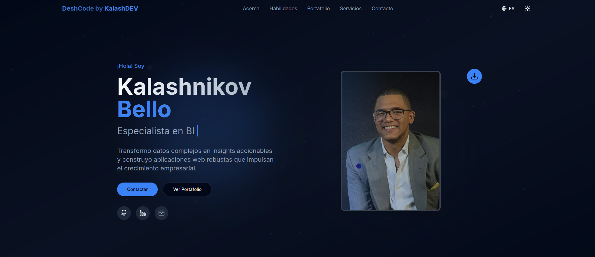

# 🚀DeshCode By KalashDEV



A modern and responsive web portfolio built with Next.js, featuring my skills as a full-stack developer and data analyst.

## ✨ Features

- 🌐 **Bilingual** - Full support for English and Spanish.
- 📱 **Responsive** - Responsive design for all devices
- 🎨 **Modern** - Elegant interface with smooth animations
- ⚡ **Fast** - Optimized for performance
- 🌙 **Dark/Clear Theme** - Automatic switching according to system preferences

## 🛠️ Technologies Used

- **Framework:** Next.js
- Styling:** Tailwind CSS
- Animations:** Framer Motion
- Icons:** Lucide React
- Components:** shadcn/ui
- Language:** TypeScript

## 🚀 Installation and Use

1. **Clone the repository**

````bash
git clone https://github.com/tu-usuario/portfolio-kalashnikov.git
cd portfolio-kalashnikov
````

2. **Install dependencies**

````bash
  pnpm install
````

3 **Run the development server**

````bash
pnpm run dev
````

4. **Open your browser**

Visit [http://localhost:3000](http://localhost:3000)

## 📄 License

This project is under License. See the `LICENSE` file for more details.

---

⭐ If you like this project, give it a star on GitHub!
